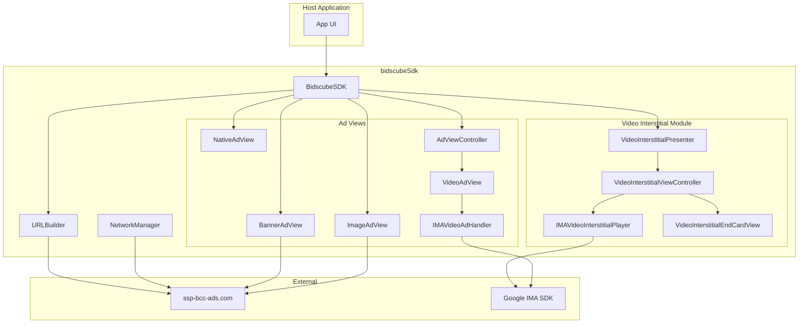
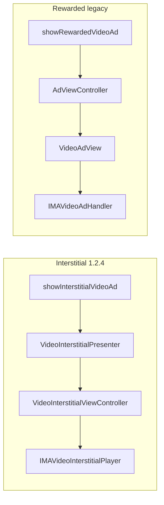

# Architecture

System design of the BidsCube iOS SDK (v1.2.5).

---

## High-level diagram



---

## Layering

| Layer | Responsibility |
|-------|----------------|
| **Facade** | `BidscubeSDK` — public API, config, banner registry |
| **Presentation** | View controllers, SwiftUI wrappers, presenters |
| **Ad views** | Format-specific rendering (WebView, native layout, IMA) |
| **Networking** | URL building, HTTP, device info |
| **Core** | Types, callbacks, constants, SKAdNetwork, logging |

No separate service/repository layer — views often call URLSession directly.

---

## Video response flow (1.2.5)

```
NetworkManager → raw response → VideoAdPayloadResolver
  → OpenRTB pod parsing (when enabled) OR legacy root adm / raw VAST fallback
  → IMA playback
```

| Component | Role |
|-----------|------|
| `OpenRTB/VideoAdPayloadResolver.swift` | Entry point for video payload resolution |
| `OpenRTBPoddedResponseNormalizer` | Normalizes `bids[]`, `seatbid[].bid[]` |
| `PoddedPlaybackPlanBuilder` | Builds ordered pod playback slots |
| `VastPodComposer` | Composes multi-slot inline VAST for IMA `adsResponse` |

Response-side OpenRTB 2.6-style pod parsing only. The SDK does **not** build or POST OpenRTB bid requests (`OpenRTBBidRequestBuilder` is a placeholder).

---

## Dual video architecture (critical)



| Aspect | Interstitial module | Legacy handler |
|--------|--------------------|--------------------|
| IMA UI | Disabled, custom overlay | Disabled, custom close |
| VAST inline | Base64 data URI | Base64 data URI |
| End card | Yes (if VAST companion) | No |
| Skip rules | VAST companion gating | IMA skip + host gestures |
| Reward callback | No | `onUserRewarded` |

---

## Video interstitial state machine

`VideoInterstitialViewController`:

```
idle → loading → playing → skippable* → completed|skipped → showingEndCard* → closed
                                                      ↘ closed (no preview)
```

`*` skippable / showingEndCard only when `metadata.previewImageUrl != nil`

---

## Threading model

| Operation | Thread |
|-----------|--------|
| Public API entry | Caller thread; UI creation on main |
| Network callbacks | URLSession background → main for UI |
| IMA delegate events | Main (IMA guarantees) |
| Banner delayed callbacks | Main (`asyncAfter 1s`) |

Use `createOnMainThread` in BidscubeSDK for view factory methods.

---

## Memory & lifecycle

- `AdCallback` is **weak** — host must retain delegate.
- `IMAVideoInterstitialPlayer.destroy()` on dismiss / end phase.
- `AdViewController` tears down video on dismiss via `VideoAdView.finalizeDismissalFromFullscreenHost`.
- `BidscubeSDK.cleanup()` removes banner references.

---

## Dependencies

| Dependency | Integration |
|------------|-------------|
| Google IMA | SPM in Xcode project + podspec for CocoaPods |
| UIKit | Primary UI |
| WebKit | Banner, image HTML |
| AVFoundation | IMA content playhead |
| StoreKit | SKAdNetwork (iOS 14+) |

---

## Build targets discrepancy

| Source | iOS minimum |
|--------|-------------|
| Package.swift | 13.0 |
| podspec | 13.0 |
| Xcode project (framework) | 14.0 |

Integrators on iOS 13 use SPM/Pods metadata. Internal Xcode project may use iOS 14 APIs in test app (e.g. SwiftUI TabView).

---

## Extension points

| Need | Approach |
|------|----------|
| Custom render | Implement `onAdRenderOverride` |
| Custom end card metadata | Extend server + `VideoInterstitialMetadata` |
| New ad format | New view + BidscubeSDK methods + URLBuilder |
| Consent | Replace stub in BidscubeSDK consent methods |

---

## Related docs

- [codebase-map.md](codebase-map.md) — file listing
- [video-interstitial.md](video-interstitial.md) — module detail
- [ad-formats.md](ad-formats.md) — format comparison
